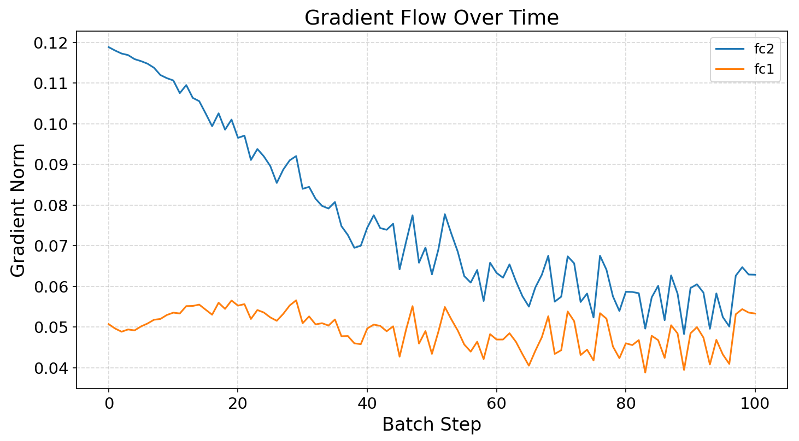
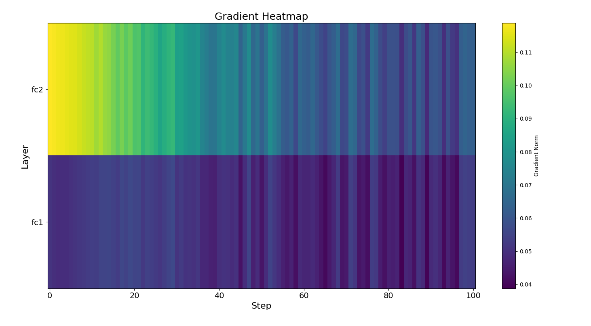

# 🧠 GradLense

**GradLense** is a lightweight and modular tool for visualizing and diagnosing gradient flow in PyTorch models. It helps detect vanishing gradients, exploding gradients, and dead layers, making it easier to debug and understand model training behavior.

<p align="center">
  
  
</p>

---

## 🚀 Features

- ✅ Gradient norm tracking across all layers
- ✅ Line plots & heatmaps of gradient flow
- ✅ Alerts for:
  - Dead (zero-gradient) layers
  - Vanishing gradients
  - Exploding gradients
- ✅ Easy integration with:
  - 🔹 Raw PyTorch
  - 🟣 PyTorch Lightning
  - 🤗 HuggingFace Transformers

---

## 📦 Installation

```bash
pip install -e .
```

Make sure you have `torch`, `matplotlib`, and optionally:
```bash
pip install pytorch-lightning transformers datasets
```

---

## 🧪 Quick Start

### 🔹 Raw PyTorch
```python
from gradlense import GradLense

model = MyModel()
gradlense = GradLense(model)
gradlense.attach()

for X, y in dataloader:
    loss = model(X).loss_fn(y)
    loss.backward()
    optimizer.step()
    optimizer.zero_grad()
    gradlense.step()

gradlense.plot_line()
gradlense.plot_heatmap()
gradlense.summarize_alerts()
```

### 🟣 PyTorch Lightning
```python
from gradlense.integrations import GradLenseCallback

gradlense = GradLense(model)
trainer = Trainer(callbacks=[GradLenseCallback(gradlense)])
```

### 🤗 HuggingFace Transformers
```python
from gradlense.integrations import GradLenseTrainerCallback

gradlense = GradLense(model)
trainer = Trainer(..., callbacks=[GradLenseTrainerCallback(gradlense)])
```

---

## 📊 Examples

```bash
# Raw MLP example
python examples/mnist_mlp.py

# Dead relu test -> exploding/vanishing gradients
python examples/dead_relu_test.py

# Lightning demo
python examples/lightning_mnist_demo.py

# HuggingFace BERT on IMDB
python examples/huggingface_imdb_demo.py
```

---

## 📁 Project Structure
```
gradlense/
├── core.py              # Main GradLense class
├── hooks.py             # Hook utilities
├── recorder.py          # Gradient statistics
├── visualizer.py        # Line plots, heatmaps
├── integrations/
│   ├── lightning.py     # PyTorch Lightning callback
│   └── huggingface.py   # HuggingFace Trainer callback
examples/
├── mnist_mlp.py
├── dead_relu_test.py
├── lightning_mnist_demo.py
├── huggingface_imdb_demo.py
```

---

## 🤝 Contributing
Pull requests are welcome! Please add tests for new features.

---

## 📜 License
MIT License — free to use, modify, and distribute.

---
